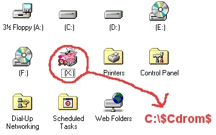



## virtual drive to make cd menus Now with a demo project

### Description

Tools for using vb to make cd menus Vdrive.vbs makes a virtual drive Vb6rtime.bat checks for installed run times BUT NOT VERSIONS use it with the cd Autorun ini
 
### More Info
 

             |
---                |---
**Submitted On**   |2000-08-14 19:45:26
**By**             |[oc](https://github.com/Planet-Source-Code/PSCIndex/blob/master/ByAuthor/oc.md)
**Level**          |Beginner
**User Rating**    |5.0 (25 globes from 5 users)
**Compatibility**  |VB 5\.0, VB 6\.0, VB Script
**Category**       |[Miscellaneous](https://github.com/Planet-Source-Code/PSCIndex/blob/master/ByCategory/miscellaneous__1-1.md)
**World**          |[Visual Basic](https://github.com/Planet-Source-Code/PSCIndex/blob/master/ByWorld/visual-basic.md)
**Archive File**   |[CODE\_UPLOAD89508142000\.zip](https://github.com/Planet-Source-Code/oc-virtual-drive-to-make-cd-menus-now-with-a-demo-project__1-10658/archive/master.zip)

